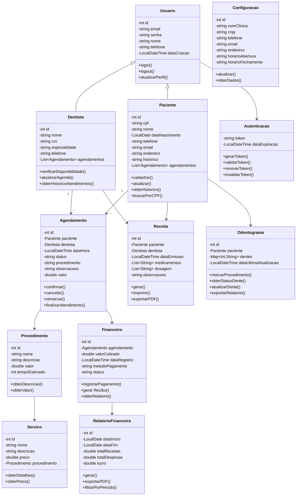
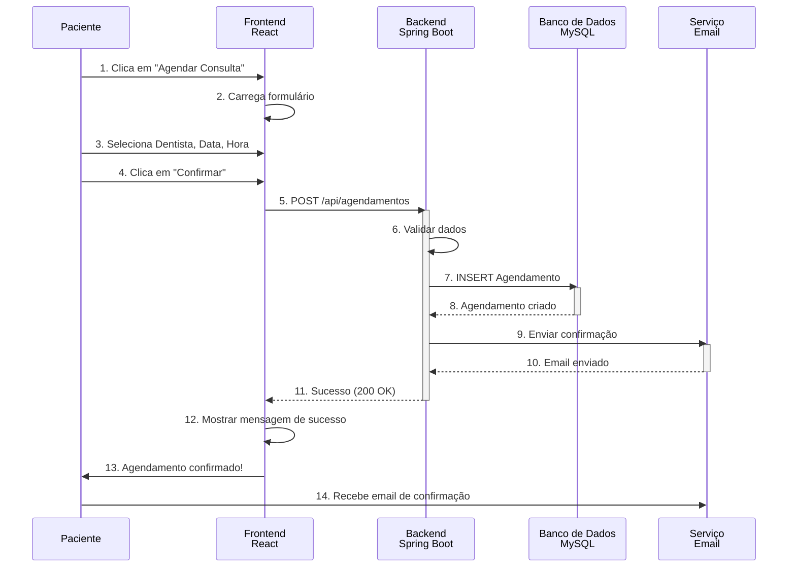
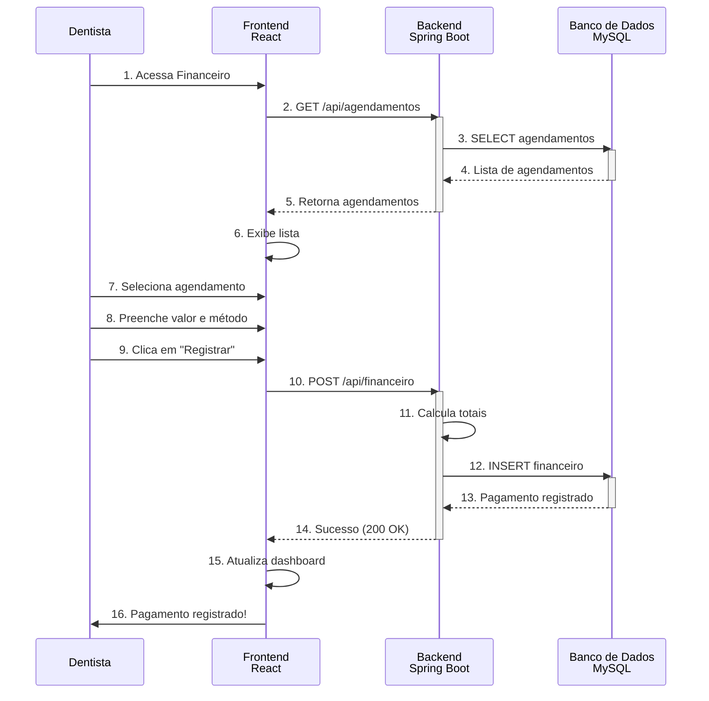
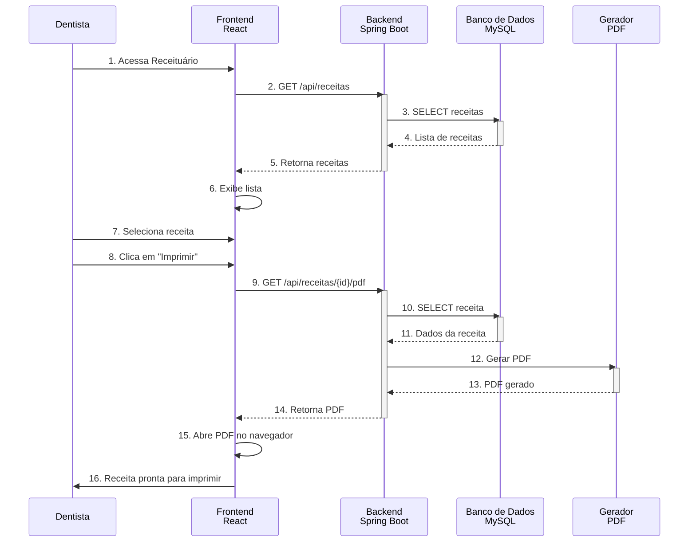
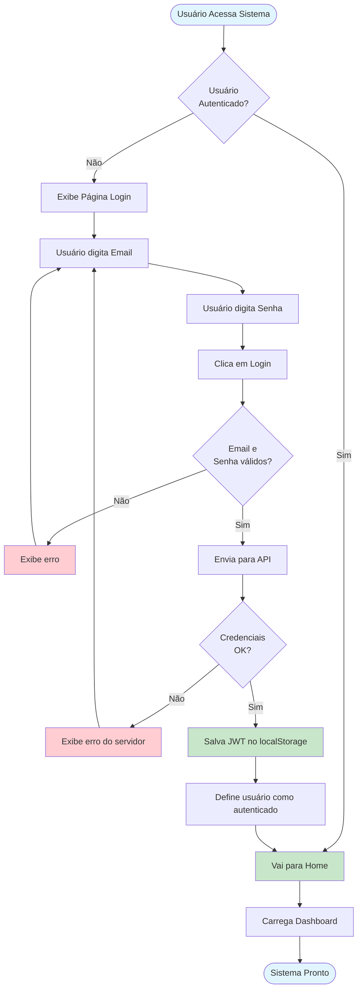
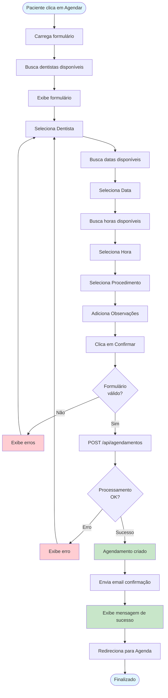
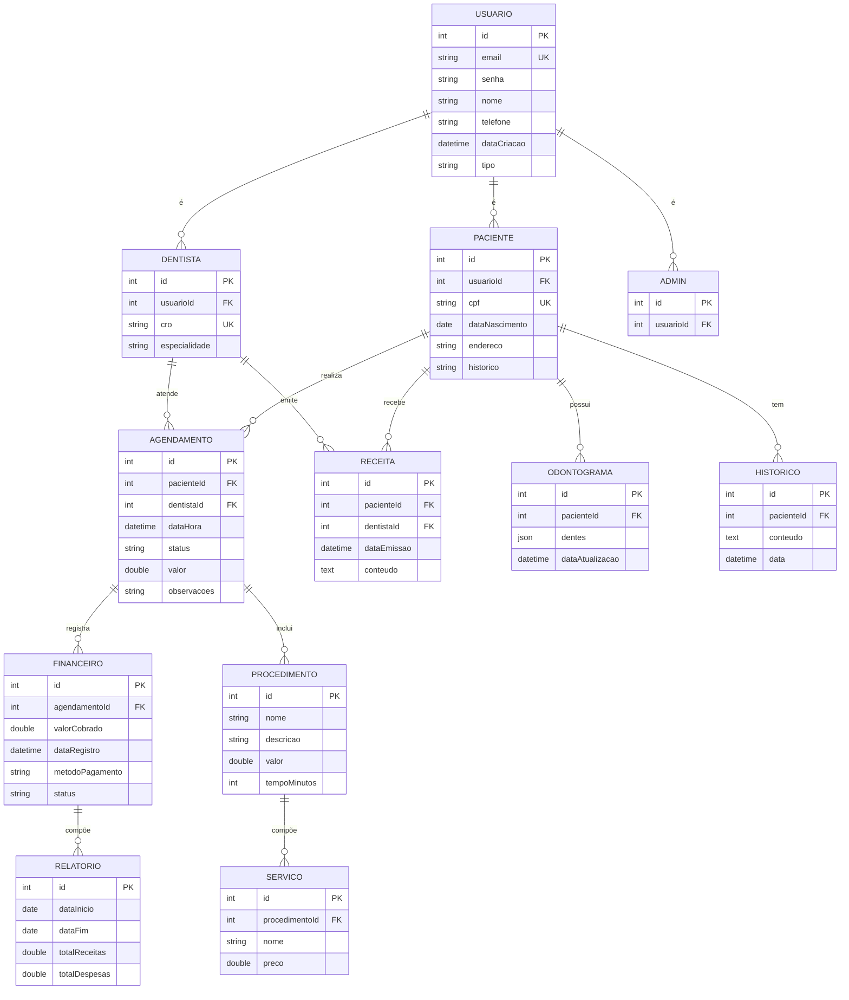

# 🦷 Clínica Odontológica - Sistema de Gestão Completo

Um sistema de gestão integrado para clínicas odontológicas, desenvolvido com tecnologias modernas para agilizar o agendamento de consultas, cadastro de pacientes, gerenciamento financeiro e muito mais.

## 📋 Índice
- [Visão Geral](#visão-geral)
- [Funcionalidades](#funcionalidades)
- [Tecnologias Utilizadas](#tecnologias-utilizadas)
- [Estrutura do Projeto](#estrutura-do-projeto)
- [Pré-requisitos](#pré-requisitos)
- [Instalação e Execução](#instalação-e-execução)
- [Guia de Uso](#guia-de-uso)
- [Screenshots](#screenshots)
- [Resolução de Problemas](#resolução-de-problemas)
- [Arquitetura](#arquitetura)
- [Segurança](#segurança)
- [Sobre o Projeto](#sobre-o-projeto)
- [Licença](#licença)

---

## 🎯 Visão Geral 

A **Clínica Odontológica** é uma solução completa de software SaaS desenvolvida para simplificar a gestão de clínicas dentárias. O sistema oferece uma interface intuitiva e funcionalidades robustas para profissionais da área odontológica, permitindo melhor organização, eficiência operacional e melhor experiência para os pacientes.

---

## ✨ Funcionalidades 

### 👥 Gestão de Pacientes
- **Cadastro de Pacientes**: Registro completo com dados pessoais, contato e histórico médico
- **Perfil do Paciente**: Visualização detalhada de informações, agendamentos e histórico de atendimentos
- **Busca e Filtros**: Encontre rapidamente pacientes por nome, CPF ou outros critérios
- **Edição de Dados**: Atualização de informações cadastrais

### 📅 Agendamento de Consultas
- **Nova Consulta**: Agendar consultas com seleção de dentista, data, horário e tipo de serviço
- **Visualização de Agenda**: Calendário interativo com visualização de todos os agendamentos
- **Confirmação Automática**: Sistema de confirmação de agendamentos
- **Retorno de Pacientes**: Controle de agendamentos de retorno
- **Orçamento de Agendamento**: Criação de orçamentos para procedimentos

### 👨‍⚕️ Gestão de Profissionais
- **Cadastro de Dentistas e Funcionários**: Registro de profissionais com especialidades
- **Perfil Profissional**: Histórico de atendimentos e disponibilidade
- **Controle de Agendas**: Visualização de agenda por profissional

### 💰 Módulo Financeiro
- **Dashboard Financeiro**: Overview de receitas, despesas e lucro
- **Registro de Sessões Financeiras**: Lançamento de valores de atendimentos realizados
- **Relatório Financeiro Detalhado**: Análise com gráficos e filtros por período
- **Orçamentos**: Criação e acompanhamento de orçamentos para procedimentos
- **Controle de Fluxo de Caixa**: Visão clara das movimentações financeiras

### 🦷 Ferramentas Odontológicas
- **Odontograma**: Representação visual interativa dos dentes para anotação de procedimentos
- **Procedimentos**: Catálogo completo de procedimentos realizados com descrições
- **Receituário**: Emissão e impressão de receitas prescritas aos pacientes
- **Impressão de Receitas**: Geração de PDF pronto para imprimir
- **Serviços**: Gestão de serviços ofertados com valores e descrições

### ⚙️ Configurações
- **Perfil da Clínica**: Dados e configurações gerais da instituição
- **Preferências de Sistema**: Ajustes de preferências e temas
- **Termos de Uso**: Política de privacidade e termos

### 📊 Dashboard e Relatórios
- **HomePage**: Resumo executivo com métricas principais (pacientes, agendamentos, faturamento)
- **Sessões Ativas**: Visualização de atendimentos em andamento
- **Landing Page**: Apresentação inicial do sistema

---

## 🛠️ Tecnologias Utilizadas 

### 🎨 Frontend - React.js

| Tecnologia | Versão | Descrição |
|------------|--------|-----------|
| **React** | 19.1.1 | Biblioteca JavaScript para construção de interfaces dinâmicas e reativas |
| **Vite** | 7.1.7 | Bundler e servidor de desenvolvimento ultra-rápido com HMR |
| **React Router DOM** | 7.9.4 | Roteamento de aplicação para navegação entre páginas |
| **Axios** | 1.12.2 | Cliente HTTP para comunicação com a API REST do backend |
| **Tailwind CSS** | 3.4.18 | Framework CSS utilitário para estilização responsiva e moderna |
| **Lucide React** | 0.545.0 | Biblioteca de ícones SVG de alta qualidade |
| **React Icons** | 5.5.0 | Coleção adicional de ícones para UI |
| **ESLint** | 9.36.0 | Linting de código JavaScript para padrão de qualidade |
| **PostCSS** | 8.5.6 | Ferramenta para transformação de CSS |

**Stack Frontend**: Aplicação Single Page Application (SPA) moderna, responsiva e performática

### 🔙 Backend - Spring Boot (Java 21)

| Tecnologia | Versão | Descrição |
|------------|--------|-----------|
| **Java** | 21 | Linguagem compilada, robusta e orientada a objetos |
| **Spring Boot** | 3.2.0 | Framework para criar aplicações Java standalone com configuração mínima |
| **Spring Data JPA** | - | Abstração para persistência de dados com ORM Hibernate |
| **Spring Security** | - | Framework de autenticação e autorização de requisições |
| **Spring Mail** | - | Módulo para envio de emails |
| **JWT (JJWT)** | 0.11.5 | Tokens seguros para autenticação stateless |
| **Swagger/OpenAPI** | 2.5.0 | Documentação automática e interativa da API REST |
| **Cloudinary** | 1.33.0 | Serviço em nuvem para armazenamento e processamento de imagens |
| **Flyway** | - | Versionamento e migração automática do banco de dados |
| **Lombok** | - | Biblioteca para redução de boilerplate em código Java |

**Stack Backend**: API RESTful robusta, segura e escalável com autenticação JWT

### 🗄️ Banco de Dados - MySQL 8.0
- **MySQL 8.0**: Banco de dados relacional confiável e amplamente utilizado
- **Flyway**: Controle de versão e migrations automáticas do schema
- **Data Persistence**: ORM JPA para abstração de dados

### 🌐 Infraestrutura e Deploy

| Tecnologia | Descrição |
|------------|-----------|
| **Docker** | Containerização da aplicação para ambiente consistente |
| **Docker Compose** | Orquestração simplificada de múltiplos containers (MySQL, Backend, Frontend) |
| **Nginx** | Servidor web de alta performance para servir o frontend estático |
| **Health Checks** | Verificação automática da saúde dos containers |

**Infraestrutura**: Deploy containerizado, escalável e fácil de manter

---

## 📁 Estrutura do Projeto 

```text
clinica-odontologica/
├── 📁 backend/               # Aplicação Java Spring Boot
│   ├── 📁 .mvn/              # Maven Wrapper
│   ├── 📁 src/
│   │   ├── 📁 main/
│   │   │   ├── 📁 java/      # Código-fonte Java
│   │   │   │   └── com/rcodontologia/
│   │   │   │       ├── 📁 controller/  # Controllers REST
│   │   │   │       ├── 📁 service/     # Lógica de negócio
│   │   │   │       ├── 📁 repository/  # Acesso a dados (JPA)
│   │   │   │       ├── 📁 model/       # Entidades JPA
│   │   │   │       ├── 📁 config/      # Configurações Spring
│   │   │   │       ├── 📁 security/    # Segurança e JWT
│   │   │   │       └── 📁 exception/   # Tratamento de erros
│   │   │   └── 📁 resources/
│   │   │       ├── application.yml     # Configuração Spring
│   │   │       └── 📁 db/migration/    # Scripts Flyway
│   │   └── 📁 test/          # Testes unitários
│   ├── pom.xml               # Dependências Maven
│   ├── Dockerfile            # Imagem Docker
│   ├── mvnw                  # Maven Wrapper (Linux/Mac)
│   └── mvnw.cmd              # Maven Wrapper (Windows)
├── 📁 frontend/              # Aplicação React + Vite
│   ├── 📁 src/
│   │   ├── 📁 pages/         # Componentes de páginas/rotas
│   │   │   ├── AgendaPage.jsx
│   │   │   ├── CadastroPacientePage.jsx
│   │   │   ├── ...
│   │   ├── 📁 components/    # Componentes reutilizáveis
│   │   ├── 📁 hooks/         # Custom React Hooks
│   │   ├── 📁 services/      # Serviços de API (Axios)
│   │   ├── 📁 utils/         # Funções utilitárias
│   │   ├── 📁 assets/        # Imagens e recursos estáticos
│   │   ├── App.jsx           # Componente raiz com rotas
│   │   ├── main.jsx          # Ponto de entrada React
│   │   └── index.css         # Estilos globais
│   ├── 📁 public/            # Arquivos públicos estáticos
│   ├── package.json          # Dependências npm
│   ├── vite.config.js        # Configuração Vite
│   ├── tailwind.config.js    # Configuração Tailwind CSS
│   ├── Dockerfile            # Imagem Docker
│   ├── nginx.conf            # Configuração Nginx
│   └── index.html            # HTML principal
├── 📁 photos/                # Screenshots da aplicação
├── docker-compose.yml        # Orquestração de containers
├── README.md                 # Documentação do projeto
├── .gitignore                # Arquivos ignorados no git
└── LICENSE                   # Licença do projeto
```

## 📋 Pré-requisitos 

Antes de começar, certifique-se de ter instalado em sua máquina:

### Obrigatório (Docker)
- **Git** (v2.0 ou superior) - Controle de versão
- **Docker** (v20.0 ou superior) - Containerização
- **Docker Compose** (v2.0 ou superior) - Orquestração

### Opcional (Desenvolvimento Local)
- **Node.js** (v18.0 ou superior) - Runtime JavaScript
- **npm** (v9.0 ou superior) - Gerenciador de pacotes
- **Java JDK** 21 LTS - Compilador Java
- **MySQL Server** (v8.0 ou superior) - Banco de dados
- **Maven** (v3.8 ou superior) - Gerenciador de build Java

---

## 🚀 Instalação e Execução 

### ✅ Opção 1: Com Docker Compose (Recomendado)
Esta é a forma mais rápida e recomendada para executar o projeto completo.

#### Passo 1: Clonar o Repositório

```bash
git clone https://github.com/grsantos56/clinica-odontologica.git
cd clinica-odontologica
```

#### Passo 2: Configurar Variáveis de Ambiente

Abra o arquivo `docker-compose.yml` e configure as seguintes variáveis de ambiente:

```yaml
services:
  mysql:
    environment:
      MYSQL_ROOT_PASSWORD: 'senha_segura_123'       # Mude para uma senha forte
      MYSQL_DATABASE: 'clinica_db'                  # Nome do banco de dados

  backend:
    environment:
      SPRING_DATASOURCE_USERNAME: 'root'            # Usuário MySQL
      SPRING_DATASOURCE_PASSWORD: 'senha_segura_123' # Mesma senha acima
      APP_CORS_ALLOWED_ORIGIN: 'http://localhost'   # URL do frontend
      
  frontend:
    environment:
      VITE_API_URL: 'http://localhost:8080'         # URL do backend
```

#### Passo 3: Iniciar os Serviços

```bash
# Construir e iniciar todos os containers em background
docker-compose up -d --build
```

Ou em primeiro plano (para ver os logs):

```bash
docker-compose up --build
```

Este comando irá:
- 🗄️ Criar e iniciar o container MySQL na porta 3306
- 🔙 Construir e iniciar o container Backend Spring Boot na porta 8080
- 🎨 Construir e iniciar o container Frontend React na porta 80

#### Passo 4: Aguardar Inicialização

Aguarde alguns minutos enquanto os serviços inicializam.

Verificar status dos containers:

```bash
docker ps
```

Ver logs de um serviço específico:

```bash
docker-compose logs -f backend      # Logs do backend
docker-compose logs -f frontend     # Logs do frontend
docker-compose logs -f mysql        # Logs do MySQL
```

#### Passo 5: Acessar a Aplicação

Abra seu navegador e acesse:
- **Frontend:** http://localhost (ou http://localhost:5173 para desenvolvimento local)
- **Documentação da API:** http://localhost:8080/swagger-ui.html

#### Parar os Serviços

```bash
# Parar todos os containers
docker-compose down
```

#### Parar e remover volumes

```bash
# Cuidado: deleta dados do banco
docker-compose down -v
```

### 💻 Opção 2: Desenvolvimento Local (Sem Docker)

#### Backend (Spring Boot)

**Pré-requisitos:**
- Java JDK 21
- MySQL 8.0 rodando localmente
- Maven 3.8+

**Passos:**

1. Navegue até o diretório backend:

```bash
cd backend
```

2. Configure o banco de dados no arquivo `src/main/resources/application.yml`:

```yaml
spring:
  datasource:
    url: jdbc:mysql://localhost:3306/clinica_db
    username: root
    password: sua_senha_mysql
    
  jpa:
    hibernate:
      ddl-auto: validate
```

3. Construa a aplicação:

```bash
./mvnw clean install
```

4. Execute a aplicação:

```bash
./mvnw spring-boot:run
```

O backend estará disponível em: http://localhost:8080  
Acessar documentação em: http://localhost:8080/swagger-ui.html

#### Frontend (React + Vite)

**Pré-requisitos:**
- Node.js 18+
- npm 9+

**Passos:**

1. Navegue até o diretório frontend:

```bash
cd frontend
```

2. Configure a URL do backend (se necessário):

```bash
# Edite o arquivo .env:
# VITE_API_URL=http://localhost:8080
```

3. Instale as dependências:

```bash
npm install
```

4. Inicie o servidor de desenvolvimento:

```bash
npm run dev
```

O frontend estará disponível em: http://localhost:5173

**Comandos úteis do frontend:**

Build para produção:

```bash
npm run build
```

Validar código com ESLint:

```bash
npm run lint
```

Preview do build de produção:

```bash
npm run preview
```

---

## 📖 Guia de Uso 

### 🔐 Login Inicial

- Acesse http://localhost (ou http://localhost:5173 em desenvolvimento)
- Você será redirecionado automaticamente para a página de login
- Use as credenciais fornecidas pelo administrador da clínica

### 👥 Cadastro de Pacientes

**Caminho:** Menu → Pacientes → Novo Paciente

1. Clique em "Pacientes" no menu lateral esquerdo
2. Selecione o botão "Novo Paciente" ou "+"
3. Preencha os dados do formulário (Pessoais, Contato, Endereço, Histórico Médico)
4. Clique em "Salvar Paciente"

### 📅 Agendar Consulta

**Caminho:** Menu → Agenda → Novo Agendamento

1. Clique em "Agenda" no menu lateral
2. Selecione "Novo Agendamento" ou "+"
3. Preencha os dados (Paciente, Dentista, Data, Horário, Procedimento)
4. Clique em "Confirmar Agendamento"

### 💰 Gestão Financeira

- **Dashboard:** Visualize o total de receitas, gráficos e transações em "Financeiro"
- **Registrar Pagamento:** Acesse "Financeiro" → "Registrar Sessão Financeira" e preencha o valor pago e método
- **Relatório:** Acesse "Financeiro" → "Relatório Financeiro" para visualizar gráficos e exportar PDFs

### 🦷 Usar Odontograma

**Caminho:** Perfil do Paciente → Odontograma

1. Abra o perfil de um paciente e clique na aba "Odontograma"
2. Clique nos dentes para anotar procedimentos
3. Salve as alterações

### 📄 Emitir Receita

**Caminho:** Menu → Receituário

1. Clique em "Nova Receita" e selecione o paciente
2. Preencha os medicamentos prescritos e dosagens
3. Clique em "Salvar" e depois em "Imprimir" para gerar o PDF

---

## � Screenshots 
### 🏠 Página Inicial (Home)

Resumo executivo com métricas principais do sistema:


### 👥 Gestão de Pacientes

Listagem e cadastro de pacientes com histórico completo:


### 📅 Agenda de Consultas

Visualização do calendário com agendamentos:


### 💰 Dashboard Financeiro

Controle de receitas, despesas e fluxo de caixa:


### 🦷 Odontograma Interativo

Representação visual dos dentes para anotação de procedimentos:


---

## �🐛 Resolução de Problemas 

### ❌ Erro: "Conexão recusada ao banco de dados"

**Causa:** O container MySQL não está rodando.

**Solução:** Verifique o status dos containers e inicie o MySQL:

```bash
docker ps
docker-compose up -d mysql
```

Tente conectar:

```bash
docker-compose exec mysql mysql -u root -p'sua_senha' -e "SELECT 1"
```

### ❌ Erro: "Porta 80 já em uso"

**Causa:** A porta 80 já está sendo usada.

**Solução:** Edite `docker-compose.yml`:

```yaml
services:
  frontend:
    ports:
      - "8888:80"  # Use a porta 8888 ao invés de 80
```

### ❌ Erro: "Frontend não carrega"

**Causa:** Cache ou erro de conexão.

**Solução:** Limpe o cache ou reinicie o container:

```bash
docker-compose restart frontend
curl http://localhost:8080/swagger-ui.html
```

### ❌ Erro: "CORS Policy Block"

**Causa:** Frontend e backend com origens diferentes.

**Solução:** Verifique a variável no `docker-compose.yml`:

```yaml
APP_CORS_ALLOWED_ORIGIN: "http://localhost"
```

---

## 📊 Arquitetura 

```plaintext
┌─────────────────────────────────────────────────────────────┐
│                     CLIENTE (Browser)                       │
│                  Frontend React + Vite                      │
│         http://localhost (Nginx - porta 80)                 │
└────────────────────────┬────────────────────────────────────┘
                         │ HTTP/HTTPS
                         │ REST API
┌────────────────────────▼────────────────────────────────────┐
│                 API GATEWAY / NGINX                         │
│            Reverse Proxy (porta 80 → 8080)                  │
└────────────────────────┬────────────────────────────────────┘
                         │
┌────────────────────────▼────────────────────────────────────┐
│              BACKEND - Spring Boot                          │
│              REST API (porta 8080)                          │
│  ┌──────────────────────────────────────────────────────┐   │
│  │ Controllers, Services, Repositories                  │   │
│  │ Autenticação JWT, Validação, Lógica de Negócio     │   │
│  └──────────────────────────────────────────────────────┘   │
└────────────────────────┬────────────────────────────────────┘
                         │
┌────────────────────────▼────────────────────────────────────┐
│            BANCO DE DADOS - MySQL 8.0                       │
│         (Volume Docker para Persistência)                   │
│  ┌──────────────────────────────────────────────────────┐   │
│  │ Tabelas: Pacientes, Agendamentos, Usuarios, etc...   │   │
│  └──────────────────────────────────────────────────────┘   │
└─────────────────────────────────────────────────────────────┘
```

---

## 🔒 Segurança 

✅ Autenticação JWT: Tokens seguros e stateless  
✅ CORS Configurado: Apenas origens autorizadas  
✅ Senha Criptografada: Usando BCrypt  
✅ Validação de Input: Controle server-side  

---

## 👨‍💼 Sobre o Projeto 

**Desenvolvedor:** Gabriel Rodrigues dos Santos  
**GitHub:** [@grsantos56](https://github.com/grsantos56)  
**Versão:** 0.0.1  
**Status:** Em Desenvolvimento  
**Última Atualização:** 2026-03-28  

---

## 🤝 Contato e Suporte

- **GitHub Issues:** https://github.com/grsantos56/clinica-odontologica/issues
- **GitHub Discussions:** https://github.com/grsantos56/clinica-odontologica/discussions

---

## 📄 Licença 

Este projeto é de código aberto e disponível sob a **MIT License**.

```
╔════════════════════════════════════════╗
║   🦷 CLÍNICA ODONTOLÓGICA 🦷          ║
║   Sistema de Gestão Integrado          ║
║   Eficiência • Qualidade • Inovação    ║
╚════════════════════════════════════════╝
```

# 🦷 Clínica Odontológica - Sistema de Gestão Completo

Um sistema de gestão integrado para clínicas odontológicas, desenvolvido com tecnologias modernas para agilizar o agendamento de consultas, cadastro de pacientes, gerenciamento financeiro e muito mais.

## 📋 Índice
- [Visão Geral](#visão-geral)
- [Funcionalidades](#funcionalidades)
- [Tecnologias Utilizadas](#tecnologias-utilizadas)
- [Estrutura do Projeto](#estrutura-do-projeto)
- [Pré-requisitos](#pré-requisitos)
- [Instalação e Execução](#instalação-e-execução)
- [Guia de Uso](#guia-de-uso)
- [Screenshots](#screenshots)
- [Resolução de Problemas](#resolução-de-problemas)
- [Arquitetura](#arquitetura)
- [Segurança](#segurança)
- [Sobre o Projeto](#sobre-o-projeto)
- [Licença](#licença)

---

## 🎯 Visão Geral 

A **Clínica Odontológica** é uma solução completa de software SaaS desenvolvida para simplificar a gestão de clínicas dentárias. O sistema oferece uma interface intuitiva e funcionalidades robustas para profissionais da área odontológica, permitindo melhor organização, eficiência operacional e melhor experiência para os pacientes.

---

## ✨ Funcionalidades 

### 👥 Gestão de Pacientes
- **Cadastro de Pacientes**: Registro completo com dados pessoais, contato e histórico médico
- **Perfil do Paciente**: Visualização detalhada de informações, agendamentos e histórico de atendimentos
- **Busca e Filtros**: Encontre rapidamente pacientes por nome, CPF ou outros critérios
- **Edição de Dados**: Atualização de informações cadastrais

### 📅 Agendamento de Consultas
- **Nova Consulta**: Agendar consultas com seleção de dentista, data, horário e tipo de serviço
- **Visualização de Agenda**: Calendário interativo com visualização de todos os agendamentos
- **Confirmação Automática**: Sistema de confirmação de agendamentos
- **Retorno de Pacientes**: Controle de agendamentos de retorno
- **Orçamento de Agendamento**: Criação de orçamentos para procedimentos

### 👨‍⚕️ Gestão de Profissionais
- **Cadastro de Dentistas e Funcionários**: Registro de profissionais com especialidades
- **Perfil Profissional**: Histórico de atendimentos e disponibilidade
- **Controle de Agendas**: Visualização de agenda por profissional

### 💰 Módulo Financeiro
- **Dashboard Financeiro**: Overview de receitas, despesas e lucro
- **Registro de Sessões Financeiras**: Lançamento de valores de atendimentos realizados
- **Relatório Financeiro Detalhado**: Análise com gráficos e filtros por período
- **Orçamentos**: Criação e acompanhamento de orçamentos para procedimentos
- **Controle de Fluxo de Caixa**: Visão clara das movimentações financeiras

### 🦷 Ferramentas Odontológicas
- **Odontograma**: Representação visual interativa dos dentes para anotação de procedimentos
- **Procedimentos**: Catálogo completo de procedimentos realizados com descrições
- **Receituário**: Emissão e impressão de receitas prescritas aos pacientes
- **Impressão de Receitas**: Geração de PDF pronto para imprimir
- **Serviços**: Gestão de serviços ofertados com valores e descrições

### ⚙️ Configurações
- **Perfil da Clínica**: Dados e configurações gerais da instituição
- **Preferências de Sistema**: Ajustes de preferências e temas
- **Termos de Uso**: Política de privacidade e termos

### 📊 Dashboard e Relatórios
- **HomePage**: Resumo executivo com métricas principais (pacientes, agendamentos, faturamento)
- **Sessões Ativas**: Visualização de atendimentos em andamento
- **Landing Page**: Apresentação inicial do sistema

---

## 🛠️ Tecnologias Utilizadas 

### 🎨 Frontend - React.js

| Tecnologia | Versão | Descrição |
|------------|--------|-----------|
| **React** | 19.1.1 | Biblioteca JavaScript para construção de interfaces dinâmicas e reativas |
| **Vite** | 7.1.7 | Bundler e servidor de desenvolvimento ultra-rápido com HMR |
| **React Router DOM** | 7.9.4 | Roteamento de aplicação para navegação entre páginas |
| **Axios** | 1.12.2 | Cliente HTTP para comunicação com a API REST do backend |
| **Tailwind CSS** | 3.4.18 | Framework CSS utilitário para estilização responsiva e moderna |
| **Lucide React** | 0.545.0 | Biblioteca de ícones SVG de alta qualidade |
| **React Icons** | 5.5.0 | Coleção adicional de ícones para UI |
| **ESLint** | 9.36.0 | Linting de código JavaScript para padrão de qualidade |
| **PostCSS** | 8.5.6 | Ferramenta para transformação de CSS |

**Stack Frontend**: Aplicação Single Page Application (SPA) moderna, responsiva e performática

### 🔙 Backend - Spring Boot (Java 21)

| Tecnologia | Versão | Descrição |
|------------|--------|-----------|
| **Java** | 21 | Linguagem compilada, robusta e orientada a objetos |
| **Spring Boot** | 3.2.0 | Framework para criar aplicações Java standalone com configuração mínima |
| **Spring Data JPA** | - | Abstração para persistência de dados com ORM Hibernate |
| **Spring Security** | - | Framework de autenticação e autorização de requisições |
| **Spring Mail** | - | Módulo para envio de emails |
| **JWT (JJWT)** | 0.11.5 | Tokens seguros para autenticação stateless |
| **Swagger/OpenAPI** | 2.5.0 | Documentação automática e interativa da API REST |
| **Cloudinary** | 1.33.0 | Serviço em nuvem para armazenamento e processamento de imagens |
| **Flyway** | - | Versionamento e migração automática do banco de dados |
| **Lombok** | - | Biblioteca para redução de boilerplate em código Java |

**Stack Backend**: API RESTful robusta, segura e escalável com autenticação JWT

### 🗄️ Banco de Dados - MySQL 8.0
- **MySQL 8.0**: Banco de dados relacional confiável e amplamente utilizado
- **Flyway**: Controle de versão e migrations automáticas do schema
- **Data Persistence**: ORM JPA para abstração de dados

### 🌐 Infraestrutura e Deploy

| Tecnologia | Descrição |
|------------|-----------|
| **Docker** | Containerização da aplicação para ambiente consistente |
| **Docker Compose** | Orquestração simplificada de múltiplos containers (MySQL, Backend, Frontend) |
| **Nginx** | Servidor web de alta performance para servir o frontend estático |
| **Health Checks** | Verificação automática da saúde dos containers |

**Infraestrutura**: Deploy containerizado, escalável e fácil de manter

---

## 📁 Estrutura do Projeto 

```text
clinica-odontologica/
├── 📁 backend/               # Aplicação Java Spring Boot
│   ├── 📁 .mvn/              # Maven Wrapper
│   ├── 📁 src/
│   │   ├── 📁 main/
│   │   │   ├── 📁 java/      # Código-fonte Java
│   │   │   │   └── com/rcodontologia/
│   │   │   │       ├── 📁 controller/  # Controllers REST
│   │   │   │       ├── 📁 service/     # Lógica de negócio
│   │   │   │       ├── 📁 repository/  # Acesso a dados (JPA)
│   │   │   │       ├── 📁 model/       # Entidades JPA
│   │   │   │       ├── 📁 config/      # Configurações Spring
│   │   │   │       ├── 📁 security/    # Segurança e JWT
│   │   │   │       └── 📁 exception/   # Tratamento de erros
│   │   │   └── 📁 resources/
│   │   │       ├── application.yml     # Configuração Spring
│   │   │       └── 📁 db/migration/    # Scripts Flyway
│   │   └── 📁 test/          # Testes unitários
│   ├── pom.xml               # Dependências Maven
│   ├── Dockerfile            # Imagem Docker
│   ├── mvnw                  # Maven Wrapper (Linux/Mac)
│   └── mvnw.cmd              # Maven Wrapper (Windows)
├── 📁 frontend/              # Aplicação React + Vite
│   ├── 📁 src/
│   │   ├── 📁 pages/         # Componentes de páginas/rotas
│   │   │   ├── AgendaPage.jsx
│   │   │   ├── CadastroPacientePage.jsx
│   │   │   ├── ...
│   │   ├── 📁 components/    # Componentes reutilizáveis
│   │   ├── 📁 hooks/         # Custom React Hooks
│   │   ├── 📁 services/      # Serviços de API (Axios)
│   │   ├── 📁 utils/         # Funções utilitárias
│   │   ├── 📁 assets/        # Imagens e recursos estáticos
│   │   ├── App.jsx           # Componente raiz com rotas
│   │   ├── main.jsx          # Ponto de entrada React
│   │   └── index.css         # Estilos globais
│   ├── 📁 public/            # Arquivos públicos estáticos
│   ├── package.json          # Dependências npm
│   ├── vite.config.js        # Configuração Vite
│   ├── tailwind.config.js    # Configuração Tailwind CSS
│   ├── Dockerfile            # Imagem Docker
│   ├── nginx.conf            # Configuração Nginx
│   └── index.html            # HTML principal
├── 📁 photos/                # Screenshots da aplicação
├── docker-compose.yml        # Orquestração de containers
├── README.md                 # Documentação do projeto
├── .gitignore                # Arquivos ignorados no git
└── LICENSE                   # Licença do projeto
```

## 📋 Pré-requisitos 

Antes de começar, certifique-se de ter instalado em sua máquina:

### Obrigatório (Docker)
- **Git** (v2.0 ou superior) - Controle de versão
- **Docker** (v20.0 ou superior) - Containerização
- **Docker Compose** (v2.0 ou superior) - Orquestração

### Opcional (Desenvolvimento Local)
- **Node.js** (v18.0 ou superior) - Runtime JavaScript
- **npm** (v9.0 ou superior) - Gerenciador de pacotes
- **Java JDK** 21 LTS - Compilador Java
- **MySQL Server** (v8.0 ou superior) - Banco de dados
- **Maven** (v3.8 ou superior) - Gerenciador de build Java

---

## 🚀 Instalação e Execução 

### ✅ Opção 1: Com Docker Compose (Recomendado)
Esta é a forma mais rápida e recomendada para executar o projeto completo.

#### Passo 1: Clonar o Repositório

```bash
git clone https://github.com/grsantos56/clinica-odontologica.git
cd clinica-odontologica
```

#### Passo 2: Configurar Variáveis de Ambiente

Abra o arquivo `docker-compose.yml` e configure as seguintes variáveis de ambiente:

```yaml
services:
  mysql:
    environment:
      MYSQL_ROOT_PASSWORD: 'senha_segura_123'       # Mude para uma senha forte
      MYSQL_DATABASE: 'clinica_db'                  # Nome do banco de dados

  backend:
    environment:
      SPRING_DATASOURCE_USERNAME: 'root'            # Usuário MySQL
      SPRING_DATASOURCE_PASSWORD: 'senha_segura_123' # Mesma senha acima
      APP_CORS_ALLOWED_ORIGIN: 'http://localhost'   # URL do frontend
      
  frontend:
    environment:
      VITE_API_URL: 'http://localhost:8080'         # URL do backend
```

#### Passo 3: Iniciar os Serviços

```bash
# Construir e iniciar todos os containers em background
docker-compose up -d --build
```

Ou em primeiro plano (para ver os logs):

```bash
docker-compose up --build
```

Este comando irá:
- 🗄️ Criar e iniciar o container MySQL na porta 3306
- 🔙 Construir e iniciar o container Backend Spring Boot na porta 8080
- 🎨 Construir e iniciar o container Frontend React na porta 80

#### Passo 4: Aguardar Inicialização

Aguarde alguns minutos enquanto os serviços inicializam.

Verificar status dos containers:

```bash
docker ps
```

Ver logs de um serviço específico:

```bash
docker-compose logs -f backend      # Logs do backend
docker-compose logs -f frontend     # Logs do frontend
docker-compose logs -f mysql        # Logs do MySQL
```

#### Passo 5: Acessar a Aplicação

Abra seu navegador e acesse:
- **Frontend:** http://localhost (ou http://localhost:5173 para desenvolvimento local)
- **Documentação da API:** http://localhost:8080/swagger-ui.html

#### Parar os Serviços

```bash
# Parar todos os containers
docker-compose down
```

#### Parar e remover volumes

```bash
# Cuidado: deleta dados do banco
docker-compose down -v
```

### 💻 Opção 2: Desenvolvimento Local (Sem Docker)

#### Backend (Spring Boot)

**Pré-requisitos:**
- Java JDK 21
- MySQL 8.0 rodando localmente
- Maven 3.8+

**Passos:**

1. Navegue até o diretório backend:

```bash
cd backend
```

2. Configure o banco de dados no arquivo `src/main/resources/application.yml`:

```yaml
spring:
  datasource:
    url: jdbc:mysql://localhost:3306/clinica_db
    username: root
    password: sua_senha_mysql
    
  jpa:
    hibernate:
      ddl-auto: validate
```

3. Construa a aplicação:

```bash
./mvnw clean install
```

4. Execute a aplicação:

```bash
./mvnw spring-boot:run
```

O backend estará disponível em: http://localhost:8080  
Acessar documentação em: http://localhost:8080/swagger-ui.html

#### Frontend (React + Vite)

**Pré-requisitos:**
- Node.js 18+
- npm 9+

**Passos:**

1. Navegue até o diretório frontend:

```bash
cd frontend
```

2. Configure a URL do backend (se necessário):

```bash
# Edite o arquivo .env:
# VITE_API_URL=http://localhost:8080
```

3. Instale as dependências:

```bash
npm install
```

4. Inicie o servidor de desenvolvimento:

```bash
npm run dev
```

O frontend estará disponível em: http://localhost:5173

**Comandos úteis do frontend:**

Build para produção:

```bash
npm run build
```

Validar código com ESLint:

```bash
npm run lint
```

Preview do build de produção:

```bash
npm run preview
```

---

## 📖 Guia de Uso 

### 🔐 Login Inicial

- Acesse http://localhost (ou http://localhost:5173 em desenvolvimento)
- Você será redirecionado automaticamente para a página de login
- Use as credenciais fornecidas pelo administrador da clínica

### 👥 Cadastro de Pacientes

**Caminho:** Menu → Pacientes → Novo Paciente

1. Clique em "Pacientes" no menu lateral esquerdo
2. Selecione o botão "Novo Paciente" ou "+"
3. Preencha os dados do formulário (Pessoais, Contato, Endereço, Histórico Médico)
4. Clique em "Salvar Paciente"

### 📅 Agendar Consulta

**Caminho:** Menu → Agenda → Novo Agendamento

1. Clique em "Agenda" no menu lateral
2. Selecione "Novo Agendamento" ou "+"
3. Preencha os dados (Paciente, Dentista, Data, Horário, Procedimento)
4. Clique em "Confirmar Agendamento"

### 💰 Gestão Financeira

- **Dashboard:** Visualize o total de receitas, gráficos e transações em "Financeiro"
- **Registrar Pagamento:** Acesse "Financeiro" → "Registrar Sessão Financeira" e preencha o valor pago e método
- **Relatório:** Acesse "Financeiro" → "Relatório Financeiro" para visualizar gráficos e exportar PDFs

### 🦷 Usar Odontograma

**Caminho:** Perfil do Paciente → Odontograma

1. Abra o perfil de um paciente e clique na aba "Odontograma"
2. Clique nos dentes para anotar procedimentos
3. Salve as alterações

### 📄 Emitir Receita

**Caminho:** Menu → Receituário

1. Clique em "Nova Receita" e selecione o paciente
2. Preencha os medicamentos prescritos e dosagens
3. Clique em "Salvar" e depois em "Imprimir" para gerar o PDF

---

## � Screenshots 
### 🏠 Página Inicial (Home)

Resumo executivo com métricas principais do sistema:


### 👥 Gestão de Pacientes

Listagem e cadastro de pacientes com histórico completo:


### 📅 Agenda de Consultas

Visualização do calendário com agendamentos:


### 💰 Dashboard Financeiro

Controle de receitas, despesas e fluxo de caixa:


### 🦷 Odontograma Interativo

Representação visual dos dentes para anotação de procedimentos:


---

## �🐛 Resolução de Problemas 

### ❌ Erro: "Conexão recusada ao banco de dados"

**Causa:** O container MySQL não está rodando.

**Solução:** Verifique o status dos containers e inicie o MySQL:

```bash
docker ps
docker-compose up -d mysql
```

Tente conectar:

```bash
docker-compose exec mysql mysql -u root -p'sua_senha' -e "SELECT 1"
```

### ❌ Erro: "Porta 80 já em uso"

**Causa:** A porta 80 já está sendo usada.

**Solução:** Edite `docker-compose.yml`:

```yaml
services:
  frontend:
    ports:
      - "8888:80"  # Use a porta 8888 ao invés de 80
```

### ❌ Erro: "Frontend não carrega"

**Causa:** Cache ou erro de conexão.

**Solução:** Limpe o cache ou reinicie o container:

```bash
docker-compose restart frontend
curl http://localhost:8080/swagger-ui.html
```

### ❌ Erro: "CORS Policy Block"

**Causa:** Frontend e backend com origens diferentes.

**Solução:** Verifique a variável no `docker-compose.yml`:

```yaml
APP_CORS_ALLOWED_ORIGIN: "http://localhost"
```

---

## 📊 Arquitetura 

```plaintext
┌─────────────────────────────────────────────────────────────┐
│                     CLIENTE (Browser)                       │
│                  Frontend React + Vite                      │
│         http://localhost (Nginx - porta 80)                 │
└────────────────────────┬────────────────────────────────────┘
                         │ HTTP/HTTPS
                         │ REST API
┌────────────────────────▼────────────────────────────────────┐
│                 API GATEWAY / NGINX                         │
│            Reverse Proxy (porta 80 → 8080)                  │
└────────────────────────┬────────────────────────────────────┘
                         │
┌────────────────────────▼────────────────────────────────────┐
│              BACKEND - Spring Boot                          │
│              REST API (porta 8080)                          │
│  ┌──────────────────────────────────────────────────────┐   │
│  │ Controllers, Services, Repositories                  │   │
│  │ Autenticação JWT, Validação, Lógica de Negócio     │   │
│  └──────────────────────────────────────────────────────┘   │
└────────────────────────┬────────────────────────────────────┘
                         │
┌────────────────────────▼────────────────────────────────────┐
│            BANCO DE DADOS - MySQL 8.0                       │
│         (Volume Docker para Persistência)                   │
│  ┌──────────────────────────────────────────────────────┐   │
│  │ Tabelas: Pacientes, Agendamentos, Usuarios, etc...   │   │
│  └──────────────────────────────────────────────────────┘   │
└─────────────────────────────────────────────────────────────┘
```

---

## 🔒 Segurança 

✅ Autenticação JWT: Tokens seguros e stateless  
✅ CORS Configurado: Apenas origens autorizadas  
✅ Senha Criptografada: Usando BCrypt  
✅ Validação de Input: Controle server-side  

---

## 👨‍💼 Sobre o Projeto 

**Desenvolvedor:** Gabriel Rodrigues dos Santos  
**GitHub:** [@grsantos56](https://github.com/grsantos56)  
**Versão:** 0.0.1  
**Status:** Em Desenvolvimento  
**Última Atualização:** 2026-03-28  

---

## 🤝 Contato e Suporte

- **GitHub Issues:** https://github.com/grsantos56/clinica-odontologica/issues
- **GitHub Discussions:** https://github.com/grsantos56/clinica-odontologica/discussions

---

## 📄 Licença 

Este projeto é de código aberto e disponível sob a **MIT License**.

```
╔════════════════════════════════════════╗
║   🦷 CLÍNICA ODONTOLÓGICA 🦷          ║
║   Sistema de Gestão Integrado          ║
║   Eficiência • Qualidade • Inovação    ║
╚════════════════════════════════════════╝
```


# 📊 Diagramas da Arquitetura - Clínica Odontológica

## 1️⃣ Diagrama de Classes (UML)




2️⃣ Diagrama de Casos de Uso (Detalhado)

```mermaid
graph LR
    subgraph Atores["🎭 ATORES"]
        P["👤 Paciente"]
        D["👨‍⚕️ Dentista"]
        A["⚙️ Admin"]
        SIS["📡 Sistema Externo"]
    end
    
    subgraph UseCases["📋 CASOS DE USO"]
        
        subgraph UC_Auth["🔐 Autenticação"]
            Login["UC01: Fazer Login"]
            Logout["UC02: Fazer Logout"]
            RecuperarSenha["UC03: Recuperar Senha"]
        end
        
        subgraph UC_Pac["👥 Pacientes"]
            CadPac["UC04: Cadastrar Paciente"]
            AtuPac["UC05: Atualizar Dados"]
            VisPac["UC06: Visualizar Perfil"]
            BuscPac["UC07: Buscar Paciente"]
            DelPac["UC08: Excluir Paciente"]
        end
        
        subgraph UC_Age["📅 Agendamentos"]
            NovoAge["UC09: Agendar Consulta"]
            VisAge["UC10: Visualizar Agenda"]
            CancAge["UC11: Cancelar Agendamento"]
            RemarAge["UC12: Remarcar Consulta"]
            ConfAge["UC13: Confirmar Agendamento"]
        end
        
        subgraph UC_Proc["🦷 Procedimentos"]
            RegProc["UC14: Registrar Procedimento"]
            VisProc["UC15: Visualizar Procedimentos"]
            UsarOdo["UC16: Usar Odontograma"]
            AtuOdo["UC17: Atualizar Odontograma"]
        end
        
        subgraph UC_Fin["💰 Financeiro"]
            RegPag["UC18: Registrar Pagamento"]
            GenRec["UC19: Gerar Recibo"]
            VisDash["UC20: Ver Dashboard Financeiro"]
            GenRel["UC21: Gerar Relatório"]
            NotFisc["UC22: Emitir Nota Fiscal"]
        end
        
        subgraph UC_Rec["📄 Receituário"]
            EmitRec["UC23: Emitir Receita"]
            ImpRec["UC24: Imprimir Receita"]
            ArvRec["UC25: Arquivar Receita"]
        end
        
        subgraph UC_Prof["👨‍⚕️ Profissionais"]
            CadDent["UC26: Cadastrar Dentista"]
            AtuDent["UC27: Atualizar Dentista"]
            VisAgDent["UC28: Ver Agenda Dentista"]
        end
        
        subgraph UC_Config["⚙️ Configurações"]
            ConfClin["UC29: Configurar Clínica"]
            MgtTerm["UC30: Gerenciar Termos"]
            BkpSist["UC31: Backup Sistema"]
        end
    end
    
    P -->|realiza| Login
    P -->|realiza| CadPac
    P -->|realiza| VisPac
    P -->|realiza| NovoAge
    P -->|realiza| VisAge
    P -->|realiza| EmitRec
    P -->|realiza| ImpRec
    P -->|realiza| Logout
    
    D -->|realiza| Login
    D -->|realiza| RegProc
    D -->|realiza| UsarOdo
    D -->|realiza| AtuOdo
    D -->|realiza| VisAge
    D -->|realiza| RegPag
    D -->|realiza| GenRec
    D -->|realiza| EmitRec
    D -->|realiza| VisAgDent
    D -->|realiza| Logout
    
    A -->|realiza| Login
    A -->|realiza| CadPac
    A -->|realiza| AtuPac
    A -->|realiza| DelPac
    A -->|realiza| BuscPac
    A -->|realiza| GenRel
    A -->|realiza| CadDent
    A -->|realiza| AtuDent
    A -->|realiza| ConfClin
    A -->|realiza| MgtTerm
    A -->|realiza| BkpSist
    A -->|realiza| Logout
    
    SIS -->|notifica| P
    SIS -->|integra| NotFisc
    
    style Login fill:#e1f5ff
    style Logout fill:#e1f5ff
    style RecuperarSenha fill:#e1f5ff
    
    style CadPac fill:#f3e5f5
    style AtuPac fill:#f3e5f5
    style VisPac fill:#f3e5f5
    
    style NovoAge fill:#e8f5e9
    style VisAge fill:#e8f5e9
    style CancAge fill:#e8f5e9
    
    style RegPag fill:#fff3e0
    style GenRel fill:#fff3e0
    style VisDash fill:#fff3e0

```


3️⃣ Diagrama de Sequência - Agendar Consulta

4️⃣ Diagrama de Sequência - Registrar Pagamento

5️⃣ Diagrama de Sequência - Emitir Receita

6️⃣ Diagrama de Fluxo - Página de Login

7️⃣ Diagrama de Fluxo - Agendar Consulta

8️⃣ Diagrama de Componentes
````mermaid
graph TB
    subgraph Client["🖥️ CLIENTE - Frontend React"]
        Components["📦 Componentes React"]
        Pages["📄 Páginas/Rotas"]
        Hooks["🪝 Custom Hooks"]
        Utils["🔧 Utilitários"]
    end
    
    subgraph Network["🌐 REDE"]
        HTTP["HTTP REST API"]
        WS["WebSocket Notifications"]
    end
    
    subgraph Server["🔙 SERVIDOR - Spring Boot"]
        Controllers["🎮 Controllers REST"]
        Services["⚙️ Services/Lógica"]
        Repositories["💾 Repositories"]
        Config["⚙️ Configurações"]
        Security["🔐 Segurança JWT"]
    end
    
    subgraph Database["🗄️ BANCO DE DADOS"]
        MySQL["MySQL 8.0"]
        Flyway["🔄 Flyway Migrations"]
    end
    
    subgraph External["🌍 SERVIÇOS EXTERNOS"]
        Email["📧 Serviço Email"]
        Cloudinary["☁️ Cloudinary Images"]
        Swagger["📚 Swagger/OpenAPI"]
    end
    
    Components --> Pages
    Pages --> Hooks
    Hooks --> Utils
    Utils --> HTTP
    
    HTTP --> Controllers
    WS --> Services
    
    Controllers --> Services
    Services --> Repositories
    Services --> Security
    Repositories --> MySQL
    Flyway --> MySQL
    
    Controllers --> Config
    Config --> Security
    
    Services --> Email
    Services --> Cloudinary
    Controllers --> Swagger
    
    style Client fill:#e3f2fd
    style Server fill:#f3e5f5
    style Database fill:#e8f5e9
    style External fill:#fff3e0
    style Network fill:#fce4ec
````
9️⃣ Diagrama de Entidade-Relacionamento (ER)

## 🎨 Paleta de Cores - UML

| Elemento        | Cor            | Uso                              |
|----------------|---------------|----------------------------------|
| Autenticação   | 🔵 #e1f5ff     | Login, Logout, Tokens            |
| Pacientes      | 🟣 #f3e5f5     | Cadastro, Perfil, Dados          |
| Agendamentos   | 🟢 #e8f5e9     | Agenda, Consultas, Slots         |
| Financeiro     | 🟠 #fff3e0     | Pagamentos, Relatórios, Recibos  |
| Erros          | 🔴 #ffcdd2     | Validações, Erros                |
| Sucesso        | ✅ #c8e6c9     | Confirmações, Salvo              |


