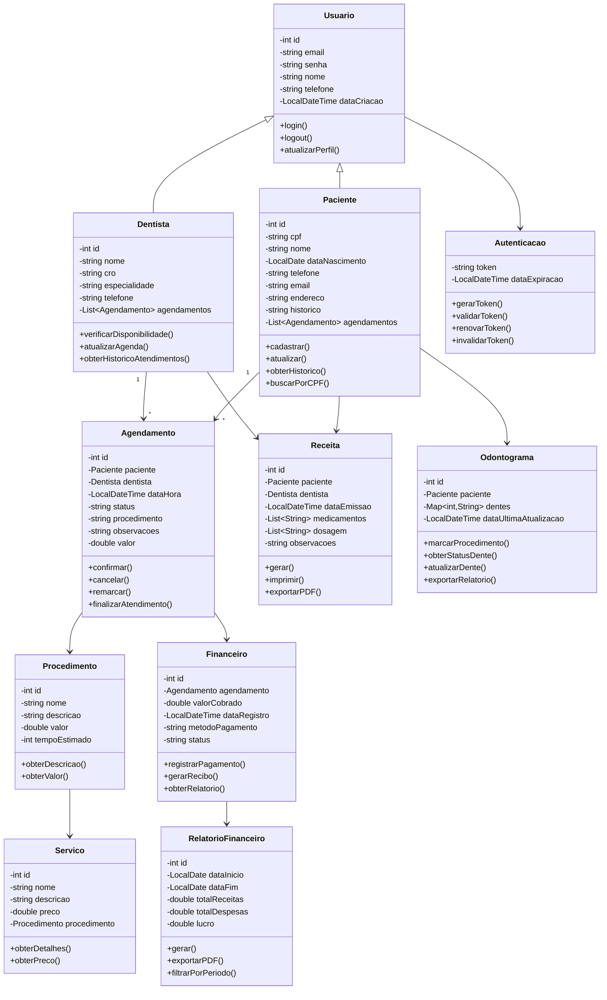
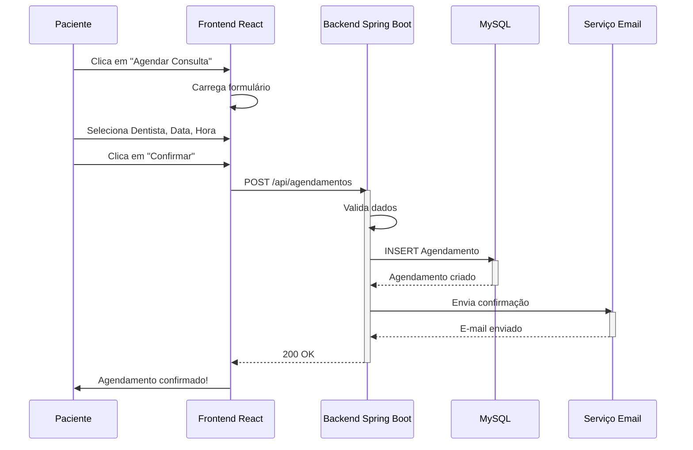
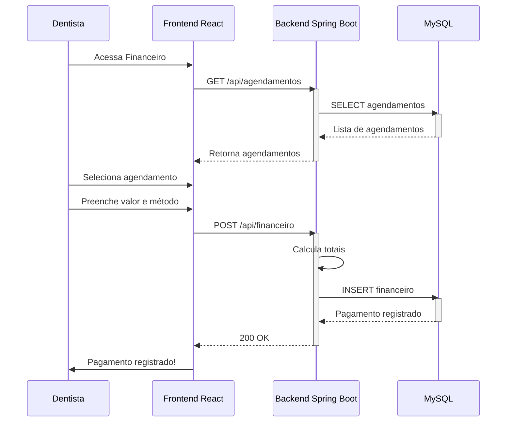
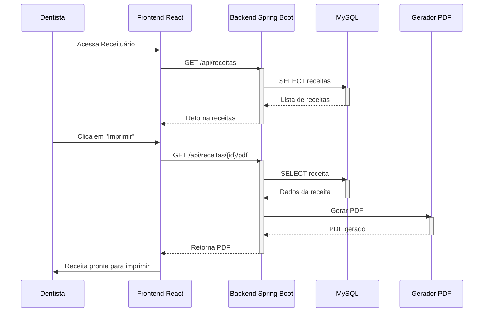
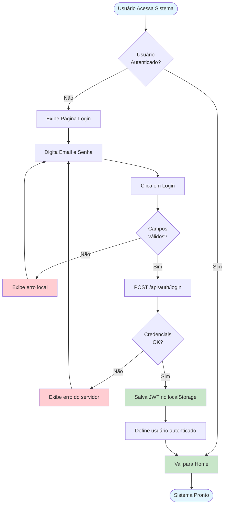
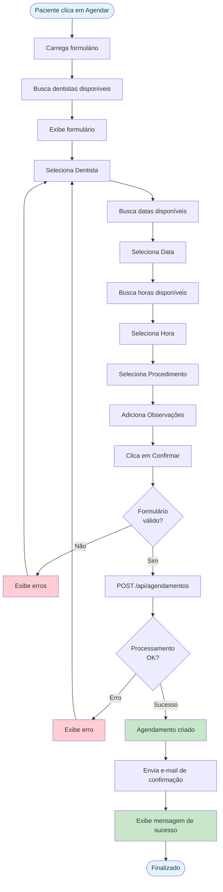
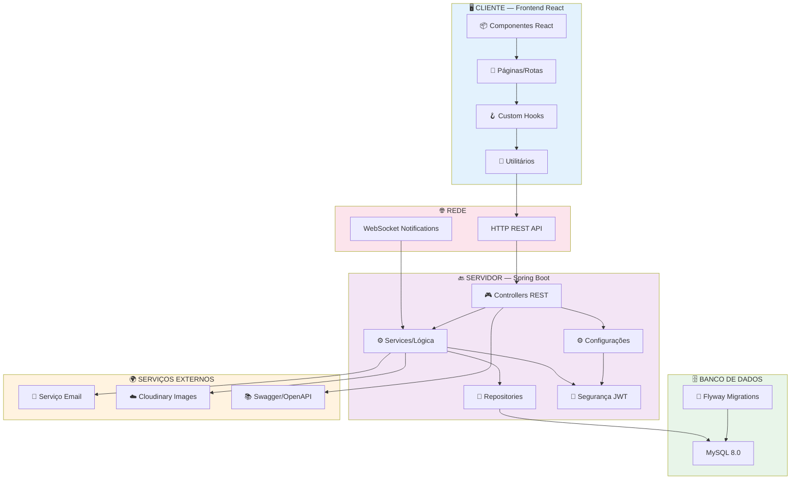
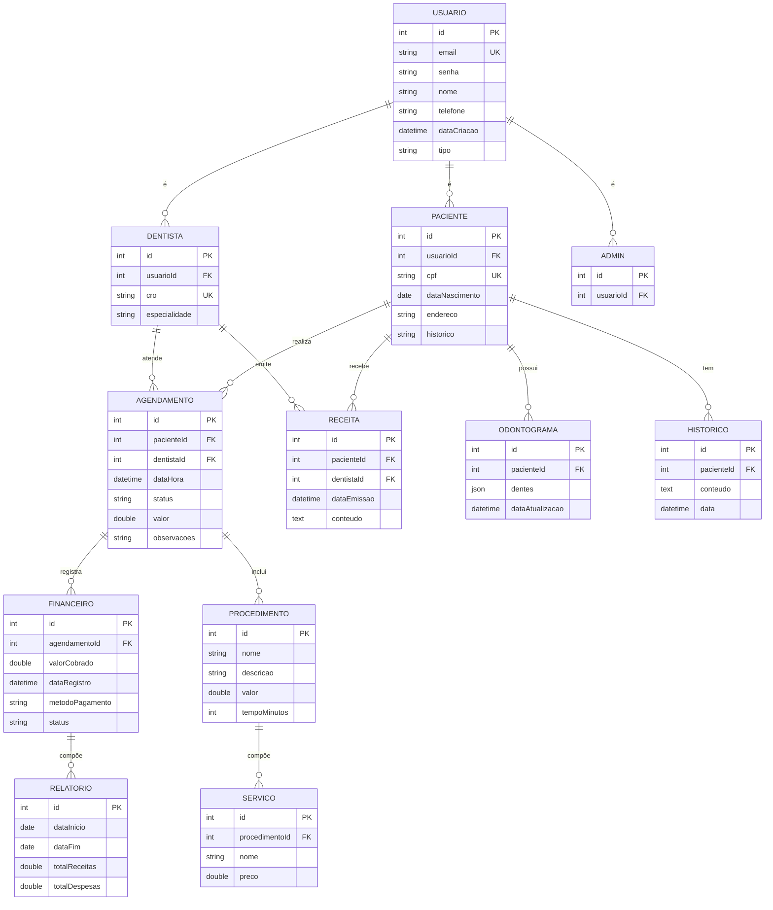
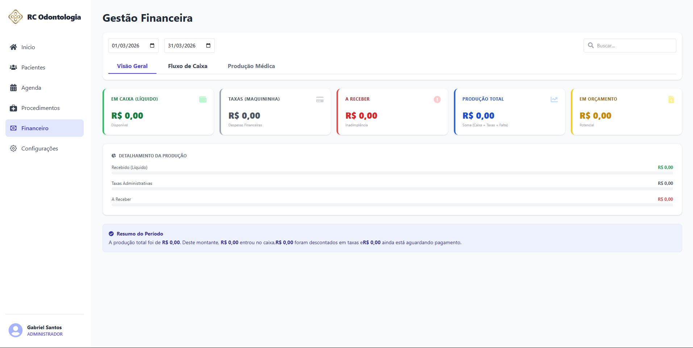

# 🦷 Clínica Odontológica — Sistema de Gestão Integrado

> Solução completa para gestão de clínicas dentárias: agendamentos, pacientes, financeiro e ferramentas odontológicas em um só lugar.


---

## 📋 Índice

### Introdução
- [Visão Geral](#-visão-geral)
- [Sobre o Projeto](#-sobre-o-projeto)

### Funcionalidades
- [Funcionalidades](#-funcionalidades)
  - [Gestão de Pacientes](#-gestão-de-pacientes)
  - [Agendamento de Consultas](#-agendamento-de-consultas)
  - [Gestão de Profissionais](#-gestão-de-profissionais)
  - [Módulo Financeiro](#-módulo-financeiro)
  - [Ferramentas Odontológicas](#-ferramentas-odontológicas)
  - [Dashboard e Configurações](#-dashboard-e-configurações)

### Tecnologia
- [Tecnologias Utilizadas](#-tecnologias-utilizadas)
  - [Frontend](#-frontend--reactjs)
  - [Backend](#-backend--spring-boot-java-21)
  - [Banco de Dados](#-banco-de-dados--mysql-80)
  - [Infraestrutura](#-infraestrutura-e-deploy)

### Arquitetura
- [Arquitetura do Sistema](#-arquitetura-do-sistema)
- [Estrutura do Projeto](#-estrutura-do-projeto)
- [Diagramas UML](#-diagramas-uml)
  - [Diagrama de Classes](#1️⃣-diagrama-de-classes)
  - [Diagrama de Casos de Uso](#2️⃣-diagrama-de-casos-de-uso)
  - [Sequência — Agendar Consulta](#3️⃣-diagrama-de-sequência--agendar-consulta)
  - [Sequência — Registrar Pagamento](#4️⃣-diagrama-de-sequência--registrar-pagamento)
  - [Sequência — Emitir Receita](#5️⃣-diagrama-de-sequência--emitir-receita)
  - [Fluxo — Login](#6️⃣-diagrama-de-fluxo--login)
  - [Fluxo — Agendar Consulta](#7️⃣-diagrama-de-fluxo--agendar-consulta)
  - [Diagrama de Componentes](#8️⃣-diagrama-de-componentes)
  - [Diagrama ER](#9️⃣-diagrama-entidade-relacionamento-er)

### Screenshots
- [Screenshots](#-screenshots)

### Instalação
- [Pré-requisitos](#-pré-requisitos)
- [Instalação e Execução](#-instalação-e-execução)
  - [Com Docker Compose](#-opção-1-com-docker-compose-recomendado)
  - [Desenvolvimento Local](#-opção-2-desenvolvimento-local-sem-docker)
- [Guia de Uso](#-guia-de-uso)

### Referência
- [Segurança](#-segurança)
- [Resolução de Problemas](#-resolução-de-problemas)
- [Licença](#-licença)

---

## 🎯 Visão Geral

A **Clínica Odontológica** é uma solução completa de software SaaS desenvolvida para simplificar a gestão de clínicas dentárias. O sistema oferece uma interface intuitiva e funcionalidades robustas para profissionais da área odontológica, permitindo melhor organização, eficiência operacional e melhor experiência para os pacientes.

---

## 👨‍💼 Sobre o Projeto

| Campo | Informação |
|---|---|
| **Desenvolvedor** | Gabriel Rodrigues dos Santos |
| **GitHub** | [@grsantos56](https://github.com/grsantos56) |
| **Versão** | 0.0.1 |
| **Status** | Em Desenvolvimento |
| **Última Atualização** | 2026-03-28 |

**Suporte e contato:**
- 🐛 [GitHub Issues](https://github.com/grsantos56/clinica-odontologica/issues)
- 💬 [GitHub Discussions](https://github.com/grsantos56/clinica-odontologica/discussions)

---

## ✨ Funcionalidades

### 👥 Gestão de Pacientes

- **Cadastro de Pacientes** — Registro completo com dados pessoais, contato e histórico médico
- **Perfil do Paciente** — Visualização detalhada de informações, agendamentos e histórico de atendimentos
- **Busca e Filtros** — Encontre rapidamente pacientes por nome, CPF ou outros critérios
- **Edição de Dados** — Atualização de informações cadastrais

### 📅 Agendamento de Consultas

- **Nova Consulta** — Agendamento com seleção de dentista, data, horário e tipo de serviço
- **Calendário Interativo** — Visualização de todos os agendamentos
- **Confirmação Automática** — E-mail de confirmação enviado ao agendar
- **Retorno de Pacientes** — Controle de agendamentos de retorno
- **Orçamento de Agendamento** — Criação de orçamentos para procedimentos

### 👨‍⚕️ Gestão de Profissionais

- **Cadastro de Dentistas e Funcionários** — Registro com especialidades
- **Perfil Profissional** — Histórico de atendimentos e disponibilidade
- **Controle de Agendas** — Visualização de agenda por profissional

### 💰 Módulo Financeiro

- **Dashboard Financeiro** — Overview de receitas, despesas e lucro
- **Registro de Sessões** — Lançamento de valores de atendimentos realizados
- **Relatório Financeiro** — Análise com gráficos e filtros por período
- **Orçamentos** — Criação e acompanhamento de orçamentos
- **Fluxo de Caixa** — Visão clara das movimentações financeiras

### 🦷 Ferramentas Odontológicas

- **Odontograma** — Representação visual interativa dos dentes para anotação de procedimentos
- **Procedimentos** — Catálogo completo com descrições e valores
- **Receituário** — Emissão e impressão de receitas prescritas aos pacientes
- **Impressão de Receitas** — Geração de PDF pronto para imprimir
- **Serviços** — Gestão de serviços ofertados com valores e descrições

### 📊 Dashboard e Configurações

- **HomePage** — Resumo executivo com métricas principais (pacientes, agendamentos, faturamento)
- **Sessões Ativas** — Visualização de atendimentos em andamento
- **Perfil da Clínica** — Dados e configurações gerais da instituição
- **Preferências de Sistema** — Ajustes de preferências e temas
- **Termos de Uso** — Política de privacidade e termos

---

## 🛠️ Tecnologias Utilizadas

### 🎨 Frontend — React.js

| Tecnologia | Versão | Descrição |
|---|---|---|
| **React** | 19.1.1 | Biblioteca JavaScript para construção de interfaces dinâmicas e reativas |
| **Vite** | 7.1.7 | Bundler e servidor de desenvolvimento ultra-rápido com HMR |
| **React Router DOM** | 7.9.4 | Roteamento de aplicação para navegação entre páginas |
| **Axios** | 1.12.2 | Cliente HTTP para comunicação com a API REST do backend |
| **Tailwind CSS** | 3.4.18 | Framework CSS utilitário para estilização responsiva e moderna |
| **Lucide React** | 0.545.0 | Biblioteca de ícones SVG de alta qualidade |
| **React Icons** | 5.5.0 | Coleção adicional de ícones para UI |
| **ESLint** | 9.36.0 | Linting de código JavaScript para padrão de qualidade |
| **PostCSS** | 8.5.6 | Ferramenta para transformação de CSS |

### 🔙 Backend — Spring Boot (Java 21)

| Tecnologia | Versão | Descrição |
|---|---|---|
| **Java** | 21 LTS | Linguagem compilada, robusta e orientada a objetos |
| **Spring Boot** | 3.2.0 | Framework para aplicações Java standalone com configuração mínima |
| **Spring Data JPA** | — | Abstração para persistência de dados com ORM Hibernate |
| **Spring Security** | — | Framework de autenticação e autorização de requisições |
| **Spring Mail** | — | Módulo para envio de e-mails |
| **JWT (JJWT)** | 0.11.5 | Tokens seguros para autenticação stateless |
| **Swagger/OpenAPI** | 2.5.0 | Documentação automática e interativa da API REST |
| **Cloudinary** | 1.33.0 | Armazenamento e processamento de imagens em nuvem |
| **Flyway** | — | Versionamento e migração automática do banco de dados |
| **Lombok** | — | Biblioteca para redução de boilerplate em código Java |

### 🗄️ Banco de Dados — MySQL 8.0

- **MySQL 8.0** — Banco de dados relacional confiável e amplamente utilizado
- **Flyway** — Controle de versão e migrations automáticas do schema
- **JPA/Hibernate** — ORM para abstração de acesso a dados

### 🌐 Infraestrutura e Deploy

| Tecnologia | Descrição |
|---|---|
| **Docker** | Containerização para ambiente consistente |
| **Docker Compose** | Orquestração de 3 containers (MySQL, Backend, Frontend) |
| **Nginx** | Servidor web de alta performance e reverse proxy |
| **Health Checks** | Verificação automática da saúde dos containers |

---

## 🏗️ Arquitetura do Sistema

```plaintext
┌─────────────────────────────────────────────────────────────┐
│                     CLIENTE (Browser)                       │
│                  Frontend React + Vite                      │
│         http://localhost (Nginx - porta 80)                 │
└────────────────────────┬────────────────────────────────────┘
                         │ HTTP/HTTPS · REST API
┌────────────────────────▼────────────────────────────────────┐
│                 API GATEWAY / NGINX                         │
│            Reverse Proxy (porta 80 → 8080)                  │
└────────────────────────┬────────────────────────────────────┘
                         │
┌────────────────────────▼────────────────────────────────────┐
│              BACKEND — Spring Boot                          │
│              REST API (porta 8080)                          │
│  Controllers · Services · Repositories                      │
│  Autenticação JWT · Validação · Lógica de Negócio           │
└────────────────────────┬────────────────────────────────────┘
                         │
┌────────────────────────▼────────────────────────────────────┐
│            BANCO DE DADOS — MySQL 8.0                       │
│         (Volume Docker para Persistência)                   │
│  Pacientes · Agendamentos · Usuários · Financeiro...        │
└─────────────────────────────────────────────────────────────┘
```

**Containers Docker Compose:**

```plaintext
┌─────────────────────────────────────────────┐
│           Docker Compose Network            │
├─────────────────────────────────────────────┤
│  Frontend Container                         │
│  ├─ Node.js + Vite (build)                  │
│  ├─ Nginx — Porta 80                        │
│  └─ Volume: ./frontend → /app               │
├─────────────────────────────────────────────┤
│  Backend Container                          │
│  ├─ Java 21 + Spring Boot 3.2               │
│  ├─ Porta 8080                              │
│  └─ Volume: ./backend → /app                │
├─────────────────────────────────────────────┤
│  MySQL Container                            │
│  ├─ MySQL 8.0                               │
│  ├─ Porta 3306                              │
│  └─ Volume Persistente: mysql_data          │
└─────────────────────────────────────────────┘
```

---

## 📁 Estrutura do Projeto

```text
clinica-odontologica/
├── 📁 backend/                        # Aplicação Java Spring Boot
│   ├── 📁 src/main/java/com/rcodontologia/
│   │   ├── 📁 controller/             # Controllers REST
│   │   ├── 📁 service/                # Lógica de negócio
│   │   ├── 📁 repository/             # Acesso a dados (JPA)
│   │   ├── 📁 model/                  # Entidades JPA
│   │   ├── 📁 config/                 # Configurações Spring
│   │   ├── 📁 security/               # Segurança e JWT
│   │   └── 📁 exception/              # Tratamento de erros
│   ├── 📁 src/main/resources/
│   │   ├── application.yml            # Configuração Spring
│   │   └── 📁 db/migration/           # Scripts Flyway
│   ├── pom.xml                        # Dependências Maven
│   └── Dockerfile
│
├── 📁 frontend/                       # Aplicação React + Vite
│   ├── 📁 src/
│   │   ├── 📁 pages/                  # Componentes de páginas/rotas
│   │   │   ├── AgendaPage.jsx
│   │   │   ├── CadastroPacientePage.jsx
│   │   │   └── ...
│   │   ├── 📁 components/             # Componentes reutilizáveis
│   │   ├── 📁 hooks/                  # Custom React Hooks
│   │   ├── 📁 services/               # Serviços de API (Axios)
│   │   ├── 📁 utils/                  # Funções utilitárias
│   │   ├── 📁 assets/                 # Imagens e recursos estáticos
│   │   ├── App.jsx                    # Componente raiz com rotas
│   │   └── main.jsx                   # Ponto de entrada React
│   ├── vite.config.js
│   ├── tailwind.config.js
│   ├── nginx.conf                     # Configuração Nginx
│   └── Dockerfile
│
├── docker-compose.yml                 # Orquestração de containers
├── README.md
└── LICENSE
```

---

## 📊 Diagramas UML

### 1️⃣ Diagrama de Classes



### 2️⃣ Diagrama de Casos de Uso

```mermaid
graph LR
    subgraph Atores["🎭 ATORES"]
        P["👤 Paciente"]
        D["👨‍⚕️ Dentista"]
        A["⚙️ Admin"]
        SIS["📡 Sistema Externo"]
    end

    subgraph UC_Auth["🔐 Autenticação"]
        Login["UC01: Fazer Login"]
        Logout["UC02: Fazer Logout"]
        RecuperarSenha["UC03: Recuperar Senha"]
    end

    subgraph UC_Pac["👥 Pacientes"]
        CadPac["UC04: Cadastrar Paciente"]
        AtuPac["UC05: Atualizar Dados"]
        VisPac["UC06: Visualizar Perfil"]
        BuscPac["UC07: Buscar Paciente"]
        DelPac["UC08: Excluir Paciente"]
    end

    subgraph UC_Age["📅 Agendamentos"]
        NovoAge["UC09: Agendar Consulta"]
        VisAge["UC10: Visualizar Agenda"]
        CancAge["UC11: Cancelar Agendamento"]
        RemarAge["UC12: Remarcar Consulta"]
        ConfAge["UC13: Confirmar Agendamento"]
    end

    subgraph UC_Proc["🦷 Procedimentos"]
        RegProc["UC14: Registrar Procedimento"]
        VisProc["UC15: Visualizar Procedimentos"]
        UsarOdo["UC16: Usar Odontograma"]
        AtuOdo["UC17: Atualizar Odontograma"]
    end

    subgraph UC_Fin["💰 Financeiro"]
        RegPag["UC18: Registrar Pagamento"]
        VisDash["UC19: Ver Dashboard Financeiro"]
        GenRel["UC20: Gerar Relatório"]
    end

    subgraph UC_Rec["📄 Receituário"]
        EmitRec["UC21: Emitir Receita"]
        ImpRec["UC22: Imprimir Receita"]
        ArvRec["UC23: Arquivar Receita"]
    end

    subgraph UC_Prof["👨‍⚕️ Profissionais"]
        CadDent["UC24: Cadastrar Dentista"]
        AtuDent["UC25: Atualizar Dentista"]
        VisAgDent["UC26: Ver Agenda Dentista"]
    end

    subgraph UC_Config["⚙️ Configurações"]
        ConfClin["UC27: Configurar Clínica"]
        MgtTerm["UC28: Gerenciar Termos"]
        BkpSist["UC29: Backup Sistema"]
    end

    P -->|realiza| Login
    P -->|realiza| CadPac
    P -->|realiza| VisPac
    P -->|realiza| NovoAge
    P -->|realiza| VisAge
    P -->|realiza| EmitRec
    P -->|realiza| ImpRec
    P -->|realiza| Logout

    D -->|realiza| Login
    D -->|realiza| RegProc
    D -->|realiza| UsarOdo
    D -->|realiza| AtuOdo
    D -->|realiza| VisAge
    D -->|realiza| RegPag
    D -->|realiza| EmitRec
    D -->|realiza| VisAgDent
    D -->|realiza| Logout

    A -->|realiza| Login
    A -->|realiza| CadPac
    A -->|realiza| AtuPac
    A -->|realiza| DelPac
    A -->|realiza| BuscPac
    A -->|realiza| GenRel
    A -->|realiza| CadDent
    A -->|realiza| AtuDent
    A -->|realiza| ConfClin
    A -->|realiza| MgtTerm
    A -->|realiza| BkpSist
    A -->|realiza| Logout

    SIS -->|notifica| P

    style Login fill:#e1f5ff
    style Logout fill:#e1f5ff
    style RecuperarSenha fill:#e1f5ff
    style CadPac fill:#f3e5f5
    style AtuPac fill:#f3e5f5
    style VisPac fill:#f3e5f5
    style NovoAge fill:#e8f5e9
    style VisAge fill:#e8f5e9
    style CancAge fill:#e8f5e9
    style RegPag fill:#fff3e0
    style GenRel fill:#fff3e0
    style VisDash fill:#fff3e0
```



### 3️⃣ Diagrama de Sequência — Agendar Consulta



### 4️⃣ Diagrama de Sequência — Registrar Pagamento



### 5️⃣ Diagrama de Sequência — Emitir Receita



### 6️⃣ Diagrama de Fluxo — Login



### 7️⃣ Diagrama de Fluxo — Agendar Consulta



### 8️⃣ Diagrama de Componentes



### 9️⃣ Diagrama Entidade-Relacionamento (ER)



**Paleta de Cores dos Diagramas:**

| Elemento | Cor | Uso |
|---|---|---|
| Autenticação | 🔵 `#e1f5ff` | Login, Logout, Tokens |
| Pacientes | 🟣 `#f3e5f5` | Cadastro, Perfil, Dados |
| Agendamentos | 🟢 `#e8f5e9` | Agenda, Consultas, Slots |
| Financeiro | 🟠 `#fff3e0` | Pagamentos, Relatórios, Recibos |
| Erros | 🔴 `#ffcdd2` | Validações, Erros |
| Sucesso | ✅ `#c8e6c9` | Confirmações, Salvo |

---

## 📸 Screenshots

### 🏠 Página Inicial (Home)

Resumo executivo com métricas principais do sistema:


### 👥 Gestão de Pacientes

Listagem e cadastro de pacientes com histórico completo:


### 📅 Agenda de Consultas

Visualização do calendário com agendamentos:


### 💰 Dashboard Financeiro

Controle de receitas, despesas e fluxo de caixa:



### 🦷 Odontograma Interativo

Representação visual dos dentes para anotação de procedimentos:


---

## 📋 Pré-requisitos

### Obrigatório — Docker

| Ferramenta | Versão | Uso |
|---|---|---|
| **Git** | v2.0+ | Controle de versão |
| **Docker** | v20.0+ | Containerização |
| **Docker Compose** | v2.0+ | Orquestração de containers |

### Opcional — Desenvolvimento Local

| Ferramenta | Versão | Uso |
|---|---|---|
| **Node.js** | v18.0+ | Runtime JavaScript |
| **npm** | v9.0+ | Gerenciador de pacotes |
| **Java JDK** | 21 LTS | Compilador Java |
| **MySQL Server** | v8.0+ | Banco de dados |
| **Maven** | v3.8+ | Gerenciador de build Java |

---

## 🚀 Instalação e Execução

### 🐳 Opção 1: Com Docker Compose (Recomendado)

> ✅ Esta é a forma mais rápida e recomendada para executar o projeto completo.

**Passo 1 — Clonar o repositório**

```bash
git clone https://github.com/grsantos56/clinica-odontologica.git
cd clinica-odontologica
```

**Passo 2 — Configurar variáveis de ambiente**

Abra o arquivo `docker-compose.yml` e ajuste:

```yaml
services:
  mysql:
    environment:
      MYSQL_ROOT_PASSWORD: 'senha_segura_123'
      MYSQL_DATABASE: 'clinica_db'

  backend:
    environment:
      SPRING_DATASOURCE_USERNAME: 'root'
      SPRING_DATASOURCE_PASSWORD: 'senha_segura_123'
      APP_CORS_ALLOWED_ORIGIN: 'http://localhost'

  frontend:
    environment:
      VITE_API_URL: 'http://localhost:8080'
```

**Passo 3 — Iniciar os serviços**

```bash
# Em background (recomendado)
docker-compose up -d --build

# Em primeiro plano (ver logs em tempo real)
docker-compose up --build
```

**Passo 4 — Verificar status**

```bash
# Status dos containers
docker ps

# Logs por serviço
docker-compose logs -f backend
docker-compose logs -f frontend
docker-compose logs -f mysql
```

**Passo 5 — Acessar a aplicação**

| Serviço | URL |
|---|---|
| **Frontend** | http://localhost |
| **API Docs (Swagger)** | http://localhost:8080/swagger-ui.html |

**Parar os serviços:**

```bash
# Parar containers
docker-compose down

# Parar e remover volumes (⚠️ apaga dados do banco)
docker-compose down -v
```

---

### 💻 Opção 2: Desenvolvimento Local (Sem Docker)

#### Backend (Spring Boot)

**Pré-requisitos:** Java JDK 21, MySQL 8.0, Maven 3.8+

```bash
cd backend
```

Configure `src/main/resources/application.yml`:

```yaml
spring:
  datasource:
    url: jdbc:mysql://localhost:3306/clinica_db
    username: root
    password: sua_senha_mysql
  jpa:
    hibernate:
      ddl-auto: validate
```

```bash
./mvnw clean install
./mvnw spring-boot:run
# Disponível em: http://localhost:8080
# Swagger em:   http://localhost:8080/swagger-ui.html
```

#### Frontend (React + Vite)

**Pré-requisitos:** Node.js 18+, npm 9+

```bash
cd frontend

# Configure o arquivo .env (se necessário):
# VITE_API_URL=http://localhost:8080

npm install
npm run dev
# Disponível em: http://localhost:5173
```

**Comandos úteis:**

```bash
npm run build    # Build para produção
npm run lint     # Validar com ESLint
npm run preview  # Preview do build de produção
```

---

## 📖 Guia de Uso

### 🔐 Login Inicial

Acesse `http://localhost` e faça login com as credenciais fornecidas pelo administrador da clínica.

### 👥 Cadastrar Paciente

**Caminho:** Menu → Pacientes → Novo Paciente

1. Clique em **Pacientes** no menu lateral
2. Selecione **Novo Paciente** ou `+`
3. Preencha os dados (Pessoais, Contato, Endereço, Histórico Médico)
4. Clique em **Salvar Paciente**

### 📅 Agendar Consulta

**Caminho:** Menu → Agenda → Novo Agendamento

1. Clique em **Agenda** no menu lateral
2. Selecione **Novo Agendamento** ou `+`
3. Preencha: Paciente, Dentista, Data, Horário, Procedimento
4. Clique em **Confirmar Agendamento**

### 💰 Gestão Financeira

**Caminho:** Menu → Financeiro

- **Registrar pagamento:** Financeiro → Registrar Sessão Financeira → preencha valor e método
- **Ver relatório:** Financeiro → Relatório Financeiro → visualize gráficos e exporte PDF

### 🦷 Usar Odontograma

**Caminho:** Perfil do Paciente → aba Odontograma

1. Abra o perfil de um paciente e clique na aba **Odontograma**
2. Clique nos dentes para anotar procedimentos
3. Salve as alterações

### 📄 Emitir Receita

**Caminho:** Menu → Receituário → Nova Receita

1. Selecione o paciente
2. Preencha os medicamentos e dosagens
3. Clique em **Salvar** e depois **Imprimir** para gerar o PDF

---

## 🔒 Segurança

| Recurso | Descrição |
|---|---|
| ✅ **Autenticação JWT** | Tokens seguros e stateless |
| ✅ **CORS Configurado** | Apenas origens autorizadas |
| ✅ **Senhas Criptografadas** | Algoritmo BCrypt |
| ✅ **Validação de Input** | Controle server-side |

---

## 🐛 Resolução de Problemas

**❌ "Conexão recusada ao banco de dados"**

> Causa: O container MySQL não está rodando.

```bash
docker ps
docker-compose up -d mysql
docker-compose exec mysql mysql -u root -p'sua_senha' -e "SELECT 1"
```

---

**❌ "Porta 80 já em uso"**

> Causa: A porta 80 já está sendo usada por outro processo.

Edite o `docker-compose.yml`:

```yaml
services:
  frontend:
    ports:
      - "8888:80"  # troque 80 por outra porta disponível
```

---

**❌ "Frontend não carrega"**

> Causa: Cache ou erro de conexão com o container.

```bash
docker-compose restart frontend
curl http://localhost:8080/swagger-ui.html
```

---

**❌ "CORS Policy Block"**

> Causa: Frontend e backend com origens diferentes.

Verifique no `docker-compose.yml`:

```yaml
APP_CORS_ALLOWED_ORIGIN: "http://localhost"
```

---

## 📄 Licença

Este projeto é de código aberto e disponível sob a **MIT License**.

```
╔════════════════════════════════════════╗
║   🦷 CLÍNICA ODONTOLÓGICA 🦷          ║
║   Sistema de Gestão Integrado          ║
║   Eficiência · Qualidade · Inovação    ║
╚════════════════════════════════════════╝
```
